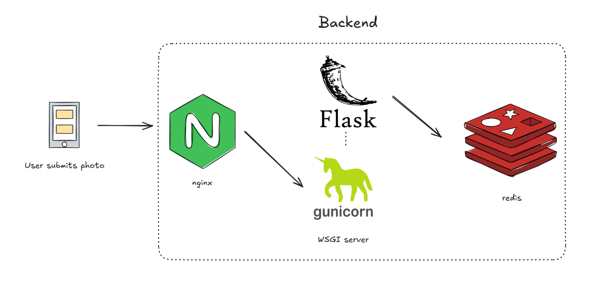
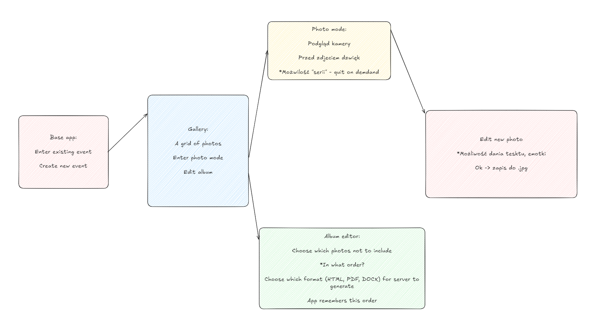
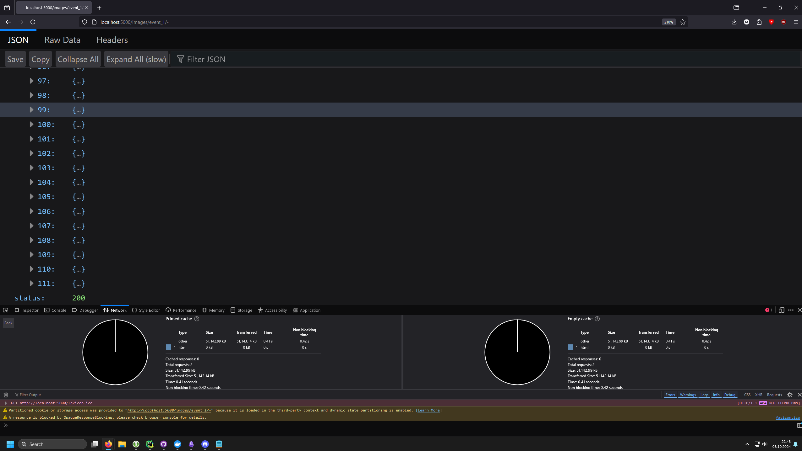

Aby odpalić, wymagany docker

z /Flask backend wykonać:
docker compose up --build


Nginx (jeszcze) nie ma





API:
### ``/event``
#### POST
Parameterless request to generate a new event - users need this name.

**RETURNs:**
- 201
```json
{  
	"event:name": "newly generated event"  
}
```


### ``/images/{event_name}``
#### POST
Takes a json, with  .jpg encoded in b64
```json
{
	"b64": "a b64 encoded jpg"
}
```
**RETURNs:**
- 201
```json
{
	"image_id": "image_id"
}
```

- "Event does not exist", 400
- "b64 not in request", 400

### ``/images/{event_name}/{image_id}``
#### GET
Get images that are newer then specified image_id.
If from the start, put in "-"

**RETURNs:**
- 200
```json
{
	"images": [
		{
			"image_id": "image_id1",
			"b64": "b64 encoded image"
		},
		{
			"image_id": "image_id2",
			"b64": "b64 encoded image"
		}
	]
}
```
- "Event does not exist", 400

### ``/album/{event_name}``
#### PUT
Parameter: json of which, and in what order photos to get in album.
And of what type (PDF, DOCX, HTML)
```json
{
  "album": 
  {
      "attributes":
      {
        "format": "PDF"
      },
      "images": 
      [
        {"image_id":  "image_id1"},
        {"image_id":  "image_id2"}
      ]
  }
}
```
**RETURNs:**
- 200
```
document of specific format
```

- "Event does not exist", 400
- "Bad request", 400

przy 112 zdjęciach jednym requestem (nigdy albo tylko raz będzie tak duży) radzi sobie swietnie.

